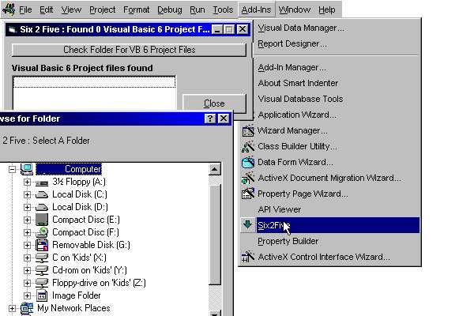



## AddIn \- convert VB6 to VB5

### Description

Its a small addin for Visual Basic 5. After you select a folder this will look in that folder for VB6 project files. All VB6 project files found are listed. You then select an item from the list, a message box will then pop up showing you the invalid keys. You then have the option of converting them (original is lost) or cancel.

please post comments and vote

email me @ witenite87@excite.com
 
### More Info
 

             |
---                |---
**Submitted On**   |2001-01-20 13:32:54
**By**             |[whiteknight](https://github.com/Planet-Source-Code/PSCIndex/blob/master/ByAuthor/whiteknight.md)
**Level**          |Intermediate
**User Rating**    |4.3 (30 globes from 7 users)
**Compatibility**  |VB 4\.0 \(32\-bit\), VB 5\.0, VB 6\.0
**Category**       |[Complete Applications](https://github.com/Planet-Source-Code/PSCIndex/blob/master/ByCategory/complete-applications__1-27.md)
**World**          |[Visual Basic](https://github.com/Planet-Source-Code/PSCIndex/blob/master/ByWorld/visual-basic.md)
**Archive File**   |[CODE\_UPLOAD141021232001\.zip](https://github.com/Planet-Source-Code/whiteknight-addin-convert-vb6-to-vb5__1-14659/archive/master.zip)

